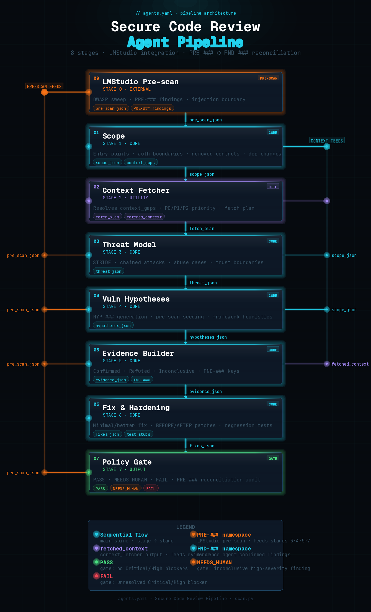

# Local Agentic Code Security Scanner

Use an agentic AI approach with JSON artifact pipelines to perform an initial secure code review. Connect to a local LM Studio instance, a cloud provider, or any OpenAI-compatible endpoint, and start doing first-pass reviews.

The pipeline scans a directory of source files, runs each file through a chain of specialized security agents (scope → threat model → hypotheses → evidence → fix → gate), and produces structured JSON artifacts and a Markdown report per file, plus a merged summary across all files.

---

## How it works

```
[Pre-scan Agent]      →  pre_scan_json  (PRE-### findings, optional)
        ↓
[Scope Agent]         →  entry points, auth boundaries, removed controls
        ↓
[Threat Model]        →  STRIDE threats, abuse cases, chained attacks
        ↓
[Vuln Hypotheses]     →  HYP-### candidates seeded from threat + pre-scan
        ↓
[Evidence Builder]    →  Confirmed / Refuted / Inconclusive + FND-### keys
        ↓
[Fix & Hardening]     →  minimal + better fix proposals per confirmed finding
        ↓
[Policy Gate]         →  PASS / NEEDS_HUMAN / FAIL decision
```

Each agent receives only the data it needs - the pipeline deliberately slims payloads between stages to stay within model context windows. All inter-agent data is written to disk as JSON so you can inspect, replay, or extend any stage independently.



---

## Project structure

| Path | Description |
|---|---|
| [`scanner/`](scanner/README.md) | Full 7-stage pipeline orchestrator (`scan.py`). Supports LM Studio, OpenAI, Anthropic, Bedrock, Azure, Gemini. |
| [`quick-scan/`](quick-scan/README.md) | Fast single-agent CI/CD scanner (`quick_scan.py`). Designed as a PR gate for Azure DevOps and GitHub Actions. |
| [`precommit-scan/`](precommit-scan/README.md) | Warn-only local pre-commit hook (`precommit_scan.py`). Runs on staged files at commit time. |
| [`parsers/`](parsers/README.md) | Post-scan utilities. `parse_findings.py` consolidates scan output; `summary_to_csv.py` exports a detailed per-finding CSV. |
| [`policies/`](policies/README.md) | Gate policy format reference and example policy. (`gate_policy.txt`)|

---

## Requirements

### Core (always required)

```bash
pip install openai pyyaml rich
```

### Per-provider (install only the ones you use)

```bash
pip install anthropic           # --anthropic
pip install boto3               # --bedrock
pip install google-generativeai # --gemini
# Azure and OpenAI use the openai package already installed above
```

### LM Studio (default backend)

- Download from [lmstudio.ai](https://lmstudio.ai/)
- Start the Local Server (default: `http://localhost:1234`)
## Local model recommendations by VRAM

All VRAM figures include model weights plus KV cache at 8192 context (the setting
required by this pipeline). Higher context lengths increase VRAM proportionally.

> **CUDA 13.2 warning:** Qwen3.6 produces gibberish outputs on CUDA 13.2.
> Use CUDA 13.1 or 12.x until NVIDIA issues a fix.
> Check your version with `nvidia-smi | grep "CUDA Version"`.

> **Ollama note:** Qwen3.6 GGUFs do not yet work in Ollama due to separate mmproj
> vision files. Use llama.cpp or Unsloth Studio instead.

---

### Qwen2.5-Coder (original recommendations)

| VRAM | Example GPUs | Model | Quant | Est. total VRAM | Notes |
|------|-------------|-------|-------|-----------------|-------|
| 8 GB | RTX 3070 Ti, RTX 4060 Ti | Qwen2.5-Coder-7B-Instruct | Q4\_K\_M | ~5 GB | Recommended in scanner README. Well-tested with this pipeline. Do not attempt 14B - weights alone exceed 8 GB before KV cache is allocated. |
| 12 GB | RTX 3080, RTX 4070 | Qwen2.5-Coder-14B-Instruct | Q4\_K\_M | ~9.6 GB | Sweet spot for 12 GB cards. Q6\_K (~11.4 GB weights) leaves under 1 GB for KV cache - avoid for this pipeline. |
| 16 GB | RTX 4060 Ti 16GB, RTX 3080 Ti | Qwen2.5-Coder-14B-Instruct | Q8\_0 | ~16.3 GB | Near-full precision on 14B. If you hit OOM on long scans, drop to Q6\_K (~11.4 GB weights, ~4 GB headroom). |
| 24 GB | RTX 3090, RTX 4090, RTX A5000 | Qwen2.5-Coder-32B-Instruct | Q4\_K\_M | ~22 GB | Top open-source code model. Benchmarks at GPT-4o level on coding tasks. Reduce context to 6144 on longer multi-file scans to preserve headroom. |
| 32 GB | RTX 5090, RTX A6000 | Qwen2.5-Coder-32B-Instruct | Q6\_K | ~29.3 GB | Near-lossless quantization on the best open-source code model. Q8\_0 (~32 GB weights alone) exceeds budget before KV cache - stick with Q6\_K. |
| 80 GB | A100 80GB, H100 80GB | Qwen2.5-Coder-72B-Instruct | Q4\_K\_M | ~47 GB | ~33 GB headroom for extended context. Alternatively run 32B at BF16 full precision (~67.5 GB total). |

---

### Qwen3.6 and Qwen3-Coder-Next (updated recommendations, April 2026)

These models supersede the Qwen2.5-Coder recommendations above at every tier where
they fit. See pipeline configuration notes below the table before switching.

| VRAM | Example GPUs | Model | Quant | Est. total VRAM | Upgrade notes |
|------|-------------|-------|-------|-----------------|---------------|
| 8 GB | RTX 3070 Ti, RTX 4060 Ti | Qwen3-8B | Q4\_K\_M | ~5.6 GB | Replaces Qwen2.5-Coder-7B. Adds hybrid thinking mode and significantly better multi-step reasoning. No Qwen3.6 variant fits at this tier. |
| 12 GB | RTX 3080, RTX 4070 | Qwen3-14B | Q4\_K\_M | ~9.8 GB | Replaces Qwen2.5-Coder-14B. Better reasoning and tool-use chains. Qwen3.6-27B at Q3 (~12.5 GB) is theoretically reachable but leaves almost no KV cache headroom - not recommended for this pipeline. |
| 16 GB | RTX 4060 Ti 16GB, RTX 3080 Ti | Qwen3-14B | Q8\_0 | ~16.4 GB | Near-lossless precision on improved base model. Qwen3.6-27B Q4\_K\_M needs 16.8 GB weights alone - it does not fit at this tier. Drop to Q6\_K (~11.4 GB) if long scans cause OOM. |
| 24 GB | RTX 3090, RTX 4090, RTX A5000 | **Qwen3.6-27B** | Q4\_K\_M or UD-Q4\_K\_XL | ~20 GB | **Major upgrade.** Scores 77.2% on SWE-bench Verified - beats the previous-gen Qwen3.5-397B-A17B MoE flagship on coding. Dense architecture, vision-capable, 262K native context, Thinking Preservation for multi-turn agent loops. Prefer Unsloth's `UD-Q4_K_XL` variant (Dynamic 2.0 calibration retains ~99% BF16 quality at Q4 file sizes). Alt: Qwen3.6-35B-A3B Q4\_K\_M (~21 GB) - same VRAM budget, ~2× faster inference via MoE. |
| 32 GB | RTX 5090, RTX A6000, RTX 6000 Ada | **Qwen3.6-27B** | Q8\_0 | ~31.6 GB | **Major upgrade.** Full Q8\_0 precision on the top single-consumer-GPU coding model. Alt: Qwen3.6-35B-A3B Q6\_K (~29.5 GB) - MoE gives faster generation; 27B dense gives more predictable output quality. Either suits this pipeline. |
| 80 GB | A100 80GB, H100 80GB, H100 SXM | **Qwen3-Coder-Next** | Q4\_K\_M | ~53 GB weights + ~27 GB KV headroom | **Major upgrade.** 80B total / 3B active MoE - purpose-built for agentic coding pipelines. 256K native context, 58.7% SWE-bench Verified. Inference speed comparable to a dense 8B model. Built specifically for long-horizon reasoning and recovery from execution failures. Non-reasoning model only (no `<think>` blocks). |

---

### Per-agent token floor guidance by tier

The `AGENT_MIN_TOKENS` values in `scan.py` were tuned for API-based providers with
large context windows. Adjust these for local models based on your hardware tier:

| Tier | Suggested `AGENT_MIN_TOKENS` |
|------|------------------------------|
| 8 GB (7B / 8B model) | `pre_scan: 2000`, `scope: 3000`, `threat: 3000`, `hypotheses: 4000`, `evidence: 6000`, `fix: 6000`, `gate: 6000` |
| 12–16 GB (14B model) | `pre_scan: 3000`, `scope: 4000`, `threat: 4000`, `hypotheses: 5000`, `evidence: 8000`, `fix: 8000`, `gate: 8000` |
| 24–32 GB (27B / 32B / 35B model) | `pre_scan: 4000`, `scope: 6000`, `threat: 6000`, `hypotheses: 8000`, `evidence: 12000`, `fix: 12000`, `gate: 12000` |
| 80 GB (Coder-Next / 72B model) | Use defaults or increase `evidence`, `fix`, `gate` to `20000`+ - headroom is ample |

---

### Pipeline configuration for Qwen3.x models

**`agents.yaml` changes required when switching to any Qwen3.x model:**

Qwen3-8B and Qwen3-14B support a hybrid thinking mode. Disable it explicitly or the
model may produce `<think>` blocks that inflate token counts and slow every agent call:

```yaml
llm:
  presence_penalty: 0.0
  # Add this for Qwen3-8B and Qwen3-14B:
  extra_body:
    enable_thinking: false
```

**Qwen3-Coder-Next** is a non-reasoning model by design - thinking mode does not apply
and `presence_penalty` is irrelevant. No changes needed beyond pointing `base_url` at
your llama.cpp or vLLM server endpoint.

**Qwen3.6-27B and Qwen3.6-35B-A3B** use Thinking Preservation across turns. For this
pipeline's stateless per-file scans, disable thinking mode the same way as Qwen3-8B/14B.

---

**LM Studio server settings (critical)**

| Setting | Value | Why |
|---|---|---|
| Context Length | `8192` | Pipeline needs up to ~6,000 tokens per call |
| GPU Offload | `99` | Forces all layers to VRAM; LMStudio clamps to actual layer count |
| Max Generated Tokens | `-1` | Let per-request `max_tokens` control output length |
| Flash Attention | On | Reduces KV cache memory ~30% |

> **GPU note:** On an 8 GB VRAM card (RTX 3070 Ti / 4060 Ti), Qwen2.5-Coder-7B Q4_K_M uses ~4.1 GB for weights + ~0.8 GB KV cache at 8192 context ≈ ~5 GB total, leaving comfortable headroom. Do not run a 14B model on 8 GB - it will split layers to CPU and become unusably slow.

---

## Quick start

```bash
# LM Studio (default - no extra flags needed)
python scanner/scan.py /path/to/code

# OpenAI
python scanner/scan.py /path/to/code --openai --api-key sk-...

# Anthropic
python scanner/scan.py /path/to/code --anthropic --api-key sk-ant-...

# AWS Bedrock (ambient credentials)
python scanner/scan.py /path/to/code --bedrock --aws-region us-east-1

# Azure AI Foundry
python scanner/scan.py /path/to/code --azure \
    --endpoint https://my-resource.openai.azure.com \
    --api-key <your-key> \
    --azure-deployment gpt-4o

# Google Gemini
python scanner/scan.py /path/to/code --gemini --api-key AIza...
```

See [`scanner/README.md`](scanner/README.md) for the full flag reference and usage examples.

---

## Supported languages and file types

### Source code
`.cs` `.py` `.rb` `.js` `.ts` `.java` `.go` `.php`

### Infrastructure as Code
`.tf` `.tfvars` `.bicep`

### Config and manifests
`.json` `.yml` `.yaml` `.config` `.xml` `.env` `.csproj` `.toml`
`requirements.txt` `package.json` `Gemfile` `Gemfile.lock` `package-lock.json` `poetry.lock`

Additional extensions from `scanner/agents.yaml → review.include_extensions` are merged in automatically. Use `--extensions` to add more at runtime without editing config.

---

## What's new

### Multi-provider LLM backend support (`scan.py`)

`scan.py` now supports six LLM backends selectable at runtime via a single CLI flag. LM Studio remains the default - no flags required for existing workflows.

| Provider | Flag | Auth |
|---|---|---|
| LM Studio (default) | `--lmstudio` | None (local) |
| OpenAI | `--openai` | `--api-key` or `OPENAI_API_KEY` |
| Anthropic | `--anthropic` | `--api-key` or `ANTHROPIC_API_KEY` |
| AWS Bedrock | `--bedrock` | Key flags, profile, or ambient credential chain |
| Azure AI Foundry | `--azure` | `--api-key` or `AZURE_OPENAI_API_KEY` |
| Google Gemini | `--gemini` | `--api-key` or `GEMINI_API_KEY` |

### New companion scripts

| Script | Purpose |
|---|---|
| `parsers/parse_findings.py` | Walks a directory of scan output folders, consolidates findings across all scan sets, produces `findings_summary.txt` and `findings_jira.csv` |
| `parsers/summary_to_csv.py` | Reads a `findings_summary.txt` file and exports a flat detailed CSV with one row per finding, including code excerpts, fix guidance, and test requirements |

---

## License

MIT
